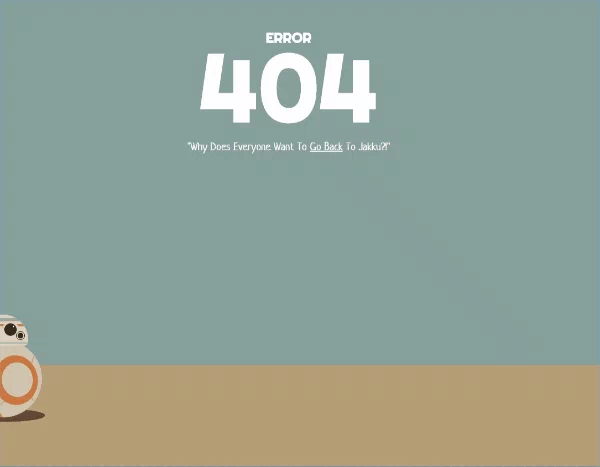

# Page 404
## Table des matières
* [1. Mardown vers HTML](https://github.com/MaximLopez/Exercice-Markdown)
* [2. Markdown vers HTML et CSS](https://github.com/MaximLopez/Learning-Environnement)
* [3. Page 404](https://github.com/MaximLopez/404-Page)
* [4. Créer un CV](https://github.com/MaximLopez/Mon-CV)
* [5. VCard](https://github.com/MaximLopez/VCard)
* [6. Star Wars](https://github.com/MaximLopez/Star-Wars-Crawl)
* [7. Présentation](https://github.com/MaximLopez/starting-web-developpment)

## Lien des consignes
[Consignes](https://github.com/becodeorg/CRL-Turing-3.10/blob/master/Parcours/01-La-prairie/html-css/4-exercice-404-html.md)
## Langages utilisés ? 
* HTML 5
* CSS3
* JavaScript
## Qui est l'auteur ? 
Ce projet a été réalisé par Maxim Lopez, alors en formation chez BeCode.<br>
[Voir le GitHub](https://github.com/maximlopez)
## De quoi s'agit-t-il ? 
Il s'agit d'une page 404 réalisé avec de l'HTML5 et du CSS3. Un template en JavaScript a également été réalisé pour faire une animation.<br>
## Quanda t-il été réalisé ? 
Ce projet a été réalisé le 24 avril 2019. Il a fallu une journée pour le réaliser.<br>
## Dans quel cadre ce projet a vu le jour ? 
Il s'agit d'un exercice réalisé lors de la période de "Prairie" chez BeCode.<br>
## Voir le projet ?
Il est possible de voir le projet grâce à GitHub Pages.<br>
[Voir la page](https://maximlopez.github.io/404-Page/)
## Progression ? 
Le projet est terminé, cependant des versions annexes pourraient arriver, suivant la progression de ma formation, d'un éventuel nettoyage du code, ou même de futur commentaire afin de préciser mon code.<br>
## Que contient t'il ? 
La page 404 contient une image de fond, un Gif et un bouton animé.<br>
## Comment le récupérer ? 
Il suffit de cloner le dépôt ou de télécharger le zip de ce dernier. Il est également possible de le voir en ligne.<br>
## Présentation du code 

* Affichage de l'HTML

``` markdown

<!DOCTYPE html>
<html lang="fr">
<!-- Préparation de la page -->
<head>
    <meta charset="UTF-8">
    <meta name="viewport" content="width=device-width, initial-scale=1.0">
    <meta http-equiv="X-UA-Compatible" content="ie=edge">
    <link rel="stylesheet" type="text/css" href="assets/css/style.css">
    <link rel="shortcut icon" href="assets/" type="image/x-icon">
    <title>404 Page</title>
</head>
<body>
    <main>
<!-- Image -->
        
<!-- Titre de la page -->
        <h1>Ici n'est pas la page que tu cherches.</h1>
<!-- Bouton retour GitHub -->
            <p> <a href="https://github.com/MaximLopez" target="_blank" rel="noopener noreferrer">Retour</a></p>
    </main>
</body>
</html>

```

* Affichage du CSS

``` markdown

/* Réglage du texte */
    h1 {
        font-size: 30px;
    }
    h1, p {
      text-align: center;
      font-family: Arial, Helvetica, sans-serif;
      color: white;
  }
    p {
    font-size: 18px;
  }
  
/* Réglage de la page */
    body {
        background-image: url("../img/background.jpg");
    }
/* Réglage du Gif */
    .gif {
      width: 30%;
      padding-bottom: 1%;
      display: block;
      margin : auto;
      margin-top : 9%;
    }

/* Réglage de l'animation */
:root {
  --mainColor: #ff9800;
}

a {
  background:
     linear-gradient(
       to bottom, var(--mainColor) 0%,
       var(--mainColor) 100%
     );
    background-position: 0 100%;
    background-repeat: repeat-x;
    background-size: 4px 4px;
  color: white;
  text-decoration: none;
  transition: background-size .2s;
}
a:hover {
  background-size: 4px 50px;
}

```